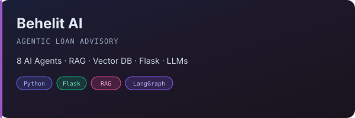
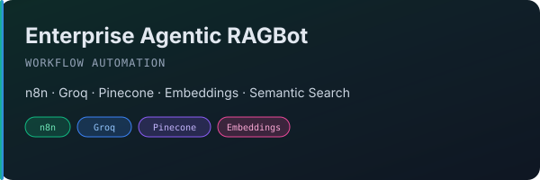
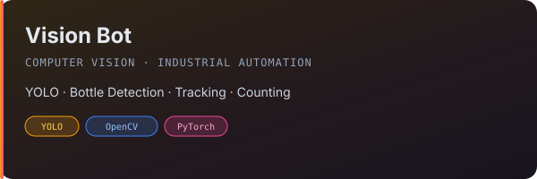
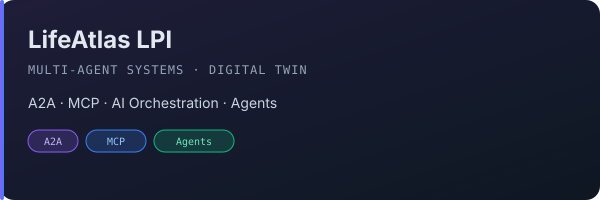
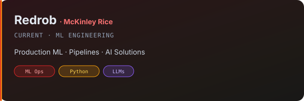
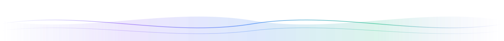

<div align="center">

<!-- ═══════════════════════════════════════════════════════════════════════ -->
<!-- ✦ ANIMATED BANNER                                                     -->
<!-- ═══════════════════════════════════════════════════════════════════════ -->



<br/>

<!-- Animated typing line -->


<br/>

<!-- Subtle motto divider -->


<br/>

<!-- Glowing motto -->
<p align="center">
  
</p>

<p align="center">
  <sub>⚡ Turning imagination into intelligent systems — one model, one agent, one deploy at a time.</sub>
</p>

</div>

---

<!-- ═══════════════════════════════════════════════════════════════════════ -->
<!-- ✦ ABOUT ME                                                            -->
<!-- ═══════════════════════════════════════════════════════════════════════ -->

##  About Me

<table>
<tr>
<td width="65%" valign="top">

I'm **Jaivardhan Singh** — a **Machine Learning Engineer** and **GenAI Developer** based in Noida, India. Currently building agentic systems at **Redrob · McKinley Rice**.

I work where **language models meet autonomous reasoning** — designing RAG pipelines, multi-agent orchestrations, and computer vision systems that don't just run, but *understand*.

- 🤖 **Building** Agentic AI systems that think, plan, and act
- 🧠 **Researching** RAG architectures, vector search, and prompt engineering
- 🛠️ **Shipping** production ML at the intersection of speed and reliability
- 🌱 **Learning** daily — LangGraph, MCP, A2A protocols, and beyond
- 💬 **Ask me about** LLMs, RAG, YOLO, FastAPI, or building AI startups
- ⚡ **Fun fact** I see a 10x engineer in everyone I meet

</td>
<td width="35%" valign="top">

```ascii
┌──────────────────────────────┐
│  JAIVARDHAN SINGH            │
│  ─────────────────────────   │
│  Role : ML Engineer          │
│  Org  : Redrob (McKinley)    │
│  Edu  : B.Tech Data Science  │
│  Loc  : Noida, India 🇮🇳     │
│  Grad : 2027                 │
│  ─────────────────────────   │
│  STATUS  ● Available         │
│  FOCUS   ▸ Agentic AI        │
│  STACK   ▸ Python · PyTorch  │
└──────────────────────────────┘
```

</td>
</tr>
</table>

---

<!-- ═══════════════════════════════════════════════════════════════════════ -->
<!-- ✦ MISSION                                                             -->
<!-- ═══════════════════════════════════════════════════════════════════════ -->

##  Mission

> **"To engineer AI systems that are not only intelligent, but intentional — built with clarity, deployed with confidence, and designed to make a difference."**
>
> I believe the next wave of software isn't written — it's *reasoned*. My mission is to help shape that wave by building agents that augment human capability and turn ambitious ideas into reliable products.

---

<!-- ═══════════════════════════════════════════════════════════════════════ -->
<!-- ✦ TECH STACK                                                          -->
<!-- ═══════════════════════════════════════════════════════════════════════ -->

##  Tech Universe

<details>
<summary><b>Languages</b></summary>
<br/>

<p>


</p>

</details>

<details>
<summary><b>AI / Machine Learning</b></summary>
<br/>

<p>


</p>

</details>

<details>
<summary><b>Frameworks & APIs</b></summary>
<br/>

<p>


</p>

</details>

<details>
<summary><b>Databases & Vector Stores</b></summary>
<br/>

<p>


</p>

</details>

<details>
<summary><b>Cloud & DevOps</b></summary>
<br/>

<p>


</p>

</details>

<details>
<summary><b>Editors & Tools</b></summary>
<br/>

<p>


</p>

</details>

---

<!-- ═══════════════════════════════════════════════════════════════════════ -->
<!-- ✦ ARCHITECTURE SKILLS                                                 -->
<!-- ═══════════════════════════════════════════════════════════════════════ -->

## 🏗️ Architecture Skills

<p align="center">
  
  
  
  
  
  
  
  
  
  
  
  
</p>

---

<!-- ═══════════════════════════════════════════════════════════════════════ -->
<!-- ✦ GITHUB ANALYTICS                                                    -->
<!-- ═══════════════════════════════════════════════════════════════════════ -->

## 📊 GitHub Analytics

<div align="center">

<p>
  
  &nbsp;
  
  &nbsp;
  
</p>

<br/>


&nbsp;


<br/><br/>


&nbsp;


</div>

<br/>

<div align="center">
  
</div>

<br/>

<div align="center">
  <sub>⚙️ Powered by <a href="https://github.com/lowlighter/metrics">lowlighter/metrics</a> · auto-updated daily</sub>
</div>

---

<!-- ═══════════════════════════════════════════════════════════════════════ -->
<!-- ✦ SNAKE ANIMATION                                                     -->
<!-- ═══════════════════════════════════════════════════════════════════════ -->

## 🐍 Contribution Snake

<div align="center">
  <picture>
    <source media="(prefers-color-scheme: dark)" srcset="https://raw.githubusercontent.com/jv-singh/jv-singh/output/github-snake-dark.svg"/>
    <source media="(prefers-color-scheme: light)" srcset="https://raw.githubusercontent.com/jv-singh/jv-singh/output/github-snake.svg"/>
    
  </picture>
</div>

<p align="center">
  <sub>🐍 Animated by <a href="https://github.com/Platane/snk">Platane/snk</a> · refreshes every 12 hours</sub>
</p>

---

<!-- ═══════════════════════════════════════════════════════════════════════ -->
<!-- ✦ FEATURED PROJECTS                                                   -->
<!-- ═══════════════════════════════════════════════════════════════════════ -->

##  Featured Projects

<div align="center">

| Project | Domain | Stack | What it does |
| :--- | :--- | :--- | :--- |
| **🟣 Behelit AI** | Agentic Loan Advisory | LangGraph · RAG · Flask · LLMs | 8 AI agents collaborating to advise on loan products |
| **🟢 Enterprise RAGBot** | Workflow Automation | n8n · Groq · Pinecone | Production RAG with semantic search & embeddings |
| **🟠 Vision Bot** | Computer Vision | YOLO · OpenCV · PyTorch | Bottle detection, tracking & industrial counting |
| **🔵 LifeAtlas LPI** | Multi-Agent | A2A · MCP · Orchestration | Digital-twin agents coordinating across systems |
| **🔴 Redrob** *(current)* | ML Engineering | Python · LLMs | Production ML pipelines at McKinley Rice |

</div>

<details>
<summary><b>🟣 Behelit AI — Agentic Loan Advisory Chatbot</b></summary>
<br/>



- **8 AI agents** orchestrated via LangGraph
- Retrieval-Augmented Generation with vector DB
- Built with Flask + Python, integrated with production LLMs
- Goal: smarter, faster, more transparent loan advisory

</details>

<details>
<summary><b>🟢 Enterprise Agentic RAGBot — Workflow Automation</b></summary>
<br/>



- End-to-end **RAG pipeline** built on **n8n + Groq + Pinecone**
- Semantic search with custom embeddings
- Designed for enterprise-grade automation

</details>

<details>
<summary><b>🟠 Vision Bot — Computer Vision for Industry</b></summary>
<br/>



- **YOLO**-based bottle detection + tracking + counting
- Industrial automation use case
- Real-time inference with OpenCV

</details>

<details>
<summary><b>🔵 LifeAtlas LPI — Multi-Agent Digital Twin</b></summary>
<br/>



- **Multi-agent** system using A2A & MCP protocols
- Digital-twin orchestration across services
- Built during internship at **LifeAtlas**

</details>

<details>
<summary><b>🔴 Redrob — Current ML Engineering Work</b></summary>
<br/>



- Currently interning as **ML Engineer** at Redrob · McKinley Rice
- Production ML pipelines, LLM integrations, AI features
- Real-world shipping at scale

</details>

---

<!-- ═══════════════════════════════════════════════════════════════════════ -->
<!-- ✦ PINNED REPOSITORIES                                                 -->
<!-- ═══════════════════════════════════════════════════════════════════════ -->

## 📌 Pinned Repositories

<div align="center">

<a href="https://github.com/jv-singh">
  
</a>
<a href="https://github.com/jv-singh">
  
</a>

<a href="https://github.com/jv-singh">
  
</a>
<a href="https://github.com/jv-singh">
  
</a>

</div>

---

<!-- ═══════════════════════════════════════════════════════════════════════ -->
<!-- ✦ EXPERIENCE TIMELINE                                                 -->
<!-- ═══════════════════════════════════════════════════════════════════════ -->

## 💼 Experience & Journey

<table>
<thead>
<tr>
<th width="22%">Period</th>
<th>Role · Organization</th>
<th>What I built / learned</th>
</tr>
</thead>
<tbody>
<tr>
<td><b>2025 — Present</b></td>
<td>🚀 <b>Machine Learning Intern</b><br/>Redrob · McKinley Rice</td>
<td>Production ML pipelines, LLM features, AI product integration</td>
</tr>
<tr>
<td><b>2024 — 2025</b></td>
<td>🤖 <b>AI Engineer Intern</b><br/>LifeAtlas</td>
<td>Multi-agent systems, A2A/MCP protocols, digital-twin orchestration</td>
</tr>
<tr>
<td><b>2024</b></td>
<td>📊 <b>Data Science Intern</b><br/>Celebal Technologies</td>
<td>Data analysis, modeling, dashboards, SQL pipelines</td>
</tr>
<tr>
<td><b>2023</b></td>
<td>🔬 <b>Data Research Intern</b><br/>Saakshar Hum Foundation</td>
<td>Research on social-impact datasets, NLP basics</td>
</tr>
</tbody>
</table>

---

<!-- ═══════════════════════════════════════════════════════════════════════ -->
<!-- ✦ EDUCATION                                                           -->
<!-- ═══════════════════════════════════════════════════════════════════════ -->

## 🎓 Education

<div align="center">

| Degree | Institution | Focus | Graduation |
| :--- | :--- | :--- | :---: |
| 🎓 **B.Tech — Data Science** | **Amity University** | ML · AI · Statistics · Engineering | **2027** |

</div>

---

<!-- ═══════════════════════════════════════════════════════════════════════ -->
<!-- ✦ ACHIEVEMENTS & GOALS                                                -->
<!-- ═══════════════════════════════════════════════════════════════════════ -->

## 🏆 Achievements & Goals

<p align="center">
  
  
  
  
</p>

### 🎯 Current Goals
- **2026** → Ship a flagship open-source Agentic AI framework
- **2026** → Publish research on multi-agent orchestration
- **2027** → Graduate and join a top AI team as a full-time engineer
- **Ongoing** → Build in public, mentor, and contribute to AI for good

---

<!-- ═══════════════════════════════════════════════════════════════════════ -->
<!-- ✦ CURRENTLY BUILDING / READING                                        -->
<!-- ═══════════════════════════════════════════════════════════════════════ -->

## 🛠️ Currently Building & Exploring

<div align="center">

| 🧱 Building | 📚 Learning | 🎧 Vibing |
| :--- | :--- | :--- |
| Agentic AI workflows | MCP / A2A protocols | Lo-fi while training models |
| RAG eval pipelines | LangGraph deep-dives | Synthwave while shipping |
| Open-source tools | Reinforcement learning | Instrumental while debugging |

</div>

---

<!-- ═══════════════════════════════════════════════════════════════════════ -->
<!-- ✦ RESEARCH INTERESTS                                                  -->
<!-- ═══════════════════════════════════════════════════════════════════════ -->

## 🔬 Research Interests

- 🤖 **Agentic AI** — autonomous, tool-using reasoning systems
- 🧠 **RAG architectures** — hybrid retrieval, reranking, evaluation
- 🎯 **Prompt engineering** — systematic, measurable, production-grade
- 👁️ **Computer vision** — detection, tracking, edge deployment
- 🧮 **Evaluation** — building benchmarks for agent quality

---

<!-- ═══════════════════════════════════════════════════════════════════════ -->
<!-- ✦ SUPPORT                                                             -->
<!-- ═══════════════════════════════════════════════════════════════════════ -->

## ☕ Support My Work

<p align="center">
  If my work helps you, consider supporting open-source AI research.
</p>

<p align="center">
  <a href="https://github.com/sponsors/jv-singh">
    
  </a>
  &nbsp;
  <a href="https://www.buymeacoffee.com/jvsingh">
    
  </a>
  &nbsp;
  <a href="https://ko-fi.com/jvsingh">
    
  </a>
</p>

---

<!-- ═══════════════════════════════════════════════════════════════════════ -->
<!-- ✦ CONNECT                                                             -->
<!-- ═══════════════════════════════════════════════════════════════════════ -->

## 🤝 Let's Connect

<p align="center">
  <a href="https://www.linkedin.com/in/jv-singh">
    
  </a>
  &nbsp;
  <a href="https://github.com/jv-singh">
    
  </a>
  &nbsp;
  <a href="https://twitter.com/jv_singh">
    
  </a>
  &nbsp;
  <a href="mailto:jaivardhan@example.com">
    
  </a>
  &nbsp;
  <a href="https://discord.gg/your-discord">
    
  </a>
</p>

---

<!-- ═══════════════════════════════════════════════════════════════════════ -->
<!-- ✦ QUOTE                                                               -->
<!-- ═══════════════════════════════════════════════════════════════════════ -->

## 💭 Words I Live By

<div align="center">

> *"The best way to predict the future is to invent it."* — **Alan Kay**

</div>

---

<!-- ═══════════════════════════════════════════════════════════════════════ -->
<!-- ✦ WAVE + FOOTER                                                       -->
<!-- ═══════════════════════════════════════════════════════════════════════ -->

<div align="center">



<br/>


<br/>

<sub>© 2026 · Designed & built with ❤️ by <b>Jaivardhan Singh</b> · Let's Make It Exist.</sub>

<br/>

⭐ **If this profile inspired you, drop a star on the repo.**

<br/>

```ascii
   ╔══════════════════════════════════════════╗
   ║   "Let's Make It Exist."                  ║
   ║   github.com/jv-singh                     ║
   ║   Jaivardhan Singh                        ║
   ╚══════════════════════════════════════════╝
```

</div>

---

<div align="center">
  
  
  
</div>
