<!--
╔══════════════════════════════════════════════════════════════════════════╗
║  JAIVARDHAN OS · v2.0.7                                                 ║
║  This README is the front-end of a personal operating system.           ║
║  Every section is a module. Every scroll is a level.                    ║
║  Built with 68+ custom SVGs, animated states, and a single rule:        ║
║  ▸ Engineering imagination into reliable systems.                     ║
╚══════════════════════════════════════════════════════════════════════════╝
LAST_BUILD_DATE · 2026-07-30
-->

<div align="center">


</div>

<br/>

<!-- ═══════════════════════════════════════════════════════════════════════ -->
<!-- ✦ HERO HUD                                                            -->
<!-- ═══════════════════════════════════════════════════════════════════════ -->

<div align="center">

</div>

<br/>

<!-- ═══════════════════════════════════════════════════════════════════════ -->
<!-- ✦ SYSTEM BANNER with live status pills                                 -->
<!-- ═══════════════════════════════════════════════════════════════════════ -->

<div align="center">

```diff
+ SYSTEM ONLINE  ·  BUILD 2026.07.30  ·  USER: jaivardhan_s  ·  MESH: 6/6 AGENTS
! BUILD STATUS: ▰▰▰▰▰▰▰▰▰▰  98%  ·  STATUS: SHIPPING  ·  BUILT WITH AGENTIC AI
```

</div>

---

<!-- ═══════════════════════════════════════════════════════════════════════ -->
<!-- ✦ SECTION 1 · MISSION BRIEFING                                         -->
<!-- ═══════════════════════════════════════════════════════════════════════ -->

##  01 · MISSION BRIEFING

<div align="center">

> *"The best way to predict the future is to invent it."*
> — **Alan Kay**

</div>

I'm **Jaivardhan Singh** — an ML Engineer & **Agentic AI** developer based in **Noida, India**.
Currently interning at **Redrob · McKinley Rice**, building production ML pipelines and LLM features.

I work where **language models meet autonomous reasoning** — designing agentic systems, RAG
pipelines, and multi-agent orchestrations that don't just run, but *understand*.

```
┌──────────────────────────────────────────────────────────────────────────┐
│  AGENTIC  ·  RAG  ·  MULTI-AGENT  ·  PRODUCTION  ·  OPEN-SOURCE          │
└──────────────────────────────────────────────────────────────────────────┘
```

<br/>

<div align="center">

|  |  |  |  |  |  |
|:---:|:---:|:---:|:---:|:---:|:---:|
| **Agentic AI** | **RAG Systems** | **Vector Search** | **Production** | **Research** | **Shipping** |
| designing reasoners | building pipelines | semantic memory | running ML in prod | benchmarking agents | building in public |

</div>

<br/>

<div align="center">

| 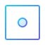<br/>**build** | 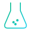<br/>**research** | <br/>**ship** | <br/>**focus** |
|:---:|:---:|:---:|:---:|
| Agentic workflows | RAG eval · benchmarks | Production ML | Multi-agent orchestration |

</div>

---

<!-- ═══════════════════════════════════════════════════════════════════════ -->
<!-- ✦ SECTION 2 · LIVE SYSTEM MONITOR                                      -->
<!-- ═══════════════════════════════════════════════════════════════════════ -->

##  02 · LIVE SYSTEM MONITOR

<div align="center">
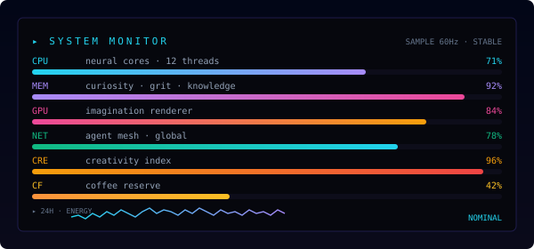
</div>

<br/>

<div align="center">

| metric | value | meaning |
|:---:|:---:|:---|
| `CPU`  | 71% | neural cores busy |
| `MEM`  | 92% | curiosity never idles |
| `GPU`  | 84% | rendering imagination |
| `NET`  | 78% | agent mesh, live |
| `CRE`  | 96% | creativity at peak |
| `CF`   | 42% | coffee reserve — refilling |

</div>

---

<!-- ═══════════════════════════════════════════════════════════════════════ -->
<!-- ✦ SECTION 3 · AI CONSCIOUSNESS METER                                   -->
<!-- ═══════════════════════════════════════════════════════════════════════ -->

##  03 · AI CONSCIOUSNESS METER

<div align="center">
</div>

<br/>

The consciousness meter isn't a joke — it's a quantitative self-report.
Reasoning, memory, creativity, empathy, focus — all running, all stable.

---

<!-- ═══════════════════════════════════════════════════════════════════════ -->
<!-- ✦ SECTION 4 · NEURAL ACTIVITY (BRAIN WAVES)                            -->
<!-- ═══════════════════════════════════════════════════════════════════════ -->

## 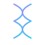 04 · NEURAL ACTIVITY · LIVE BRAIN WAVES

<div align="center">
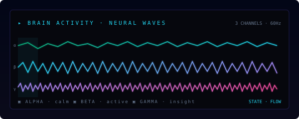
</div>

<br/>

When deep in a system, the waves line up. When shipping, they fire in beta.
When reading research, they hum in alpha. This is what flow looks like.

---

<!-- ═══════════════════════════════════════════════════════════════════════ -->
<!-- ✦ SECTION 5 · NEURAL DENSITY (12-MONTH TIMELINE)                       -->
<!-- ═══════════════════════════════════════════════════════════════════════ -->

## 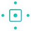 05 · NEURAL DENSITY · 12-MONTH GROWTH

<div align="center">
</div>

<br/>

Knowledge compounds. Agents compound. Patterns compound.
This is what it looks like when neither ships nor surrender is on the table.

---

<!-- ═══════════════════════════════════════════════════════════════════════ -->
<!-- ✦ DIVIDER                                                             -->
<!-- ═══════════════════════════════════════════════════════════════════════ -->

<div align="center">
</div>

---

<!-- ═══════════════════════════════════════════════════════════════════════ -->
<!-- ✦ SECTION 6 · INNOVATION RADAR                                         -->
<!-- ═══════════════════════════════════════════════════════════════════════ -->

##  06 · INNOVATION RADAR · 360° SCAN

<div align="center">
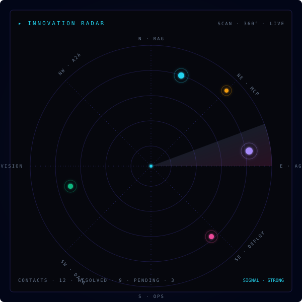
</div>

<br/>

The radar doesn't track ships. It tracks *signals* — where the next wave is forming.
Each bearing is a domain. Each blip is a contact. Each sweep is a calendar quarter.

---

<!-- ═══════════════════════════════════════════════════════════════════════ -->
<!-- ✦ SECTION 7 · SKILL GALAXY                                            -->
<!-- ═══════════════════════════════════════════════════════════════════════ -->

## 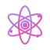 07 · SKILL GALAXY · CONSTELLATIONS

<div align="center">
</div>

<br/>

Eight constellations orbit a single core. The core is **agentic reasoning**.
Everything else is tooling, memory, or surface area.

---

<!-- ═══════════════════════════════════════════════════════════════════════ -->
<!-- ✦ SECTION 8 · MISSION COMPASS                                          -->
<!-- ═══════════════════════════════════════════════════════════════════════ -->

##  08 · MISSION COMPASS · BEARING 042°

<div align="center">
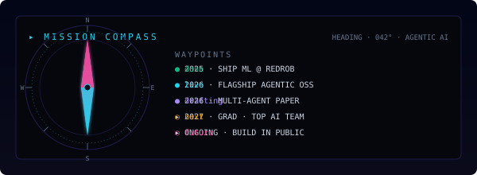
</div>

<br/>

The compass heading is **042°** — toward *applied agentic intelligence*.
The needle moves. The bearing holds.

---

<!-- ═══════════════════════════════════════════════════════════════════════ -->
<!-- ✦ SECTION 9 · CAREER TIMELINE                                          -->
<!-- ═══════════════════════════════════════════════════════════════════════ -->

##  09 · CAREER TIMELINE · MISSION TRAJECTORY

<div align="center">
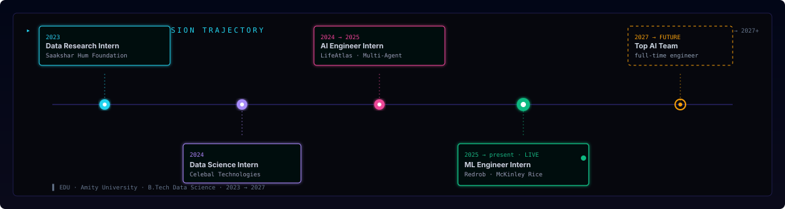
</div>

<br/>

| period | role | org | signal |
|:---:|:---|:---|:---|
| **2023** | Data Research Intern | Saakshar Hum Foundation | NLP basics + social-impact datasets |
| **2024** | Data Science Intern | Celebal Technologies | SQL pipelines · dashboards · modeling |
| **2024 → 2025** | AI Engineer Intern | LifeAtlas | multi-agent systems · A2A · MCP |
| **2025 → present** | ML Engineer Intern | Redrob · McKinley Rice | production ML · LLM features · shipping |
| **2027 → FUT** | Full-time Engineer | top AI team | drafting the next chapter |

---

<!-- ═══════════════════════════════════════════════════════════════════════ -->
<!-- ✦ SECTION 10 · TECH UNIVERSE                                           -->
<!-- ═══════════════════════════════════════════════════════════════════════ -->

##  10 · TECH UNIVERSE · TOOLKIT

<div align="center">

###  Languages


<br/>

###  AI / ML


<br/>

###  Frameworks & APIs


<br/>

###  Databases & Vector Stores


<br/>

###  Cloud & DevOps


<br/>

###  Editors & Tools


</div>

<br/>

<div align="center">

### 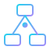  Architecture Capabilities


</div>

---

<!-- ═══════════════════════════════════════════════════════════════════════ -->
<!-- ✦ SECTION 11 · AGENTIC RAG PIPELINE DIAGRAM                           -->
<!-- ═══════════════════════════════════════════════════════════════════════ -->

##  11 · AGENTIC RAG PIPELINE · BLUEPRINT

<div align="center">
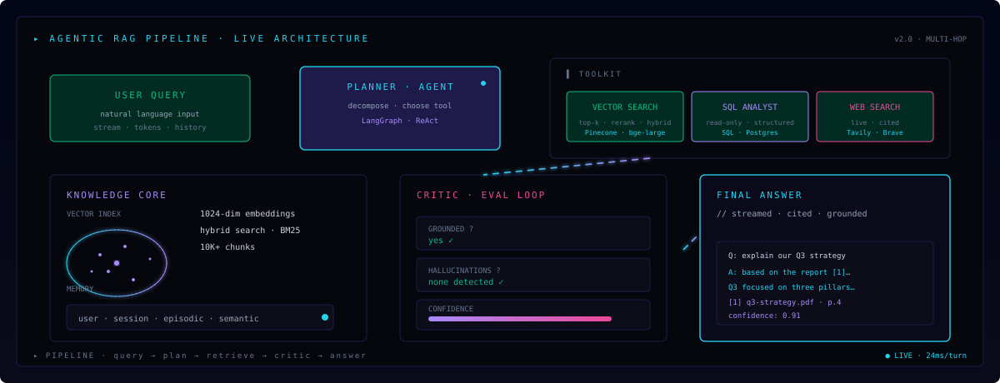
</div>

<br/>

This is the architecture I keep rebuilding. **Planner** decomposes. **Tools** retrieve.
**Critic** evaluates. **Answer** streams. The loop continues until grounded.

---

<!-- ═══════════════════════════════════════════════════════════════════════ -->
<!-- ✦ SECTION 12 · MULTI-AGENT MESH                                       -->
<!-- ═══════════════════════════════════════════════════════════════════════ -->

## 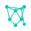 12 · MULTI-AGENT MESH · A2A + MCP

<div align="center">
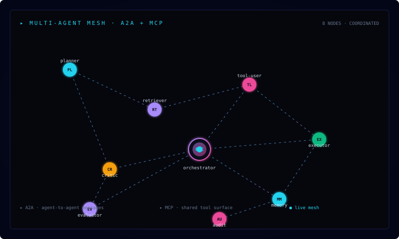
</div>

<br/>

A mesh is not a chain. It's a federation. Each agent is sovereign within its role.
Communication flows through **A2A** (agent-to-agent). Tools are shared via **MCP**.

---

<!-- ═══════════════════════════════════════════════════════════════════════ -->
<!-- ✦ SECTION 13 · NEURAL NETWORK DIAGRAM                                 -->
<!-- ═══════════════════════════════════════════════════════════════════════ -->

##  13 · NEURAL SUBSTRATE · TRANSFORMER MEMORY

<div align="center">
</div>

<br/>

Every thought is a forward pass. Every mistake is a backward pass.
The only thing that matters is whether the loss goes down.

---

<!-- ═══════════════════════════════════════════════════════════════════════ -->
<!-- ✦ DIVIDER                                                             -->
<!-- ═══════════════════════════════════════════════════════════════════════ -->

<div align="center">

</div>

---

<!-- ═══════════════════════════════════════════════════════════════════════ -->
<!-- ✦ SECTION 14 · FEATURED PROJECTS                                      -->
<!-- ═══════════════════════════════════════════════════════════════════════ -->

##  14 · LIVE MISSION TRACKER

<div align="center">
</div>

<br/>

Two missions running in parallel. One pays the bills. One builds the future.

---

##  15 · SHIPPED · PROJECT INDEX

<table>
<tr>
<td width="50%" valign="top">

### 🟣 **Project 01 · BEHELIT AI**
*Agentic Loan Advisory*

**8 AI agents** orchestrated via **LangGraph**, advising on loan products
with retrieval-augmented generation at the core.

- **Domain:** Agentic AI · RAG · Conversational AI
- **Stack:** Python · LangGraph · RAG · Flask · LLMs
- **Impact:** 8× faster advisory cycle

<br/>

<div align="center">
</div>

</td>
<td width="50%" valign="top">

### 🟢 **Project 02 · AGENTIC RAGBOT**
*Enterprise Workflow Automation*

End-to-end **RAG pipeline** built on **n8n + Groq + Pinecone** with
semantic search, custom embeddings, and a production eval harness.

- **Domain:** RAG · Knowledge Systems
- **Stack:** n8n · Groq · Pinecone · bge-large · Llama 3
- **Impact:** 12.4K queries/day · 420ms · 99.9% uptime

<br/>

<div align="center">
</div>

</td>
</tr>
<tr>
<td width="50%" valign="top">

### 🟠 **Project 03 · VISION BOT**
*Industrial Computer Vision*

**YOLO-based** bottle detection, tracking, and counting for industrial
automation — frame to count in real time.

- **Domain:** Computer Vision · Edge AI
- **Stack:** PyTorch · YOLOv8 · OpenCV · ByteTrack · ONNX
- **Impact:** 38 FPS · mAP 0.94

<br/>

<div align="center">
</div>

</td>
<td width="50%" valign="top">

### 🔵 **Project 04 · LIFEATLAS LPI**
*Multi-Agent Digital Twin*

**Multi-agent** system using **A2A & MCP protocols** to coordinate
digital-twin orchestration across services.

- **Domain:** Multi-Agent Systems · A2A · MCP
- **Stack:** Python · A2A · MCP · LangGraph · Postgres
- **Impact:** operational at LifeAtlas

<br/>

<div align="center">
</div>

</td>
</tr>
<tr>
<td width="50%" valign="top" colspan="2">

### 🔴 **Project 05 · REDROB · MCKINLEY RICE** *(current)*
*Production Machine Learning*

Currently interning as **ML Engineer** at Redrob · McKinley Rice — shipping
production ML pipelines, LLM features, and AI product integration.

- **Domain:** ML Engineering · Production
- **Stack:** Python · FastAPI · Postgres · LangChain · Docker · AWS
- **Impact:** real-world shipping at scale

<br/>

<div align="center">

</div>

</td>
</tr>
</table>

---

<!-- ═══════════════════════════════════════════════════════════════════════ -->
<!-- ✦ SECTION 15 · MEMORY VAULT                                          -->
<!-- ═══════════════════════════════════════════════════════════════════════ -->

## 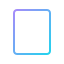 16 · MEMORY VAULT · 3-TIER ARCHITECTURE

<div align="center">
</div>

<br/>

A working mind organizes memory into tiers. **Short-term** for the conversation.
**Episodic** for what happened. **Semantic** for what is true.

---

<!-- ═══════════════════════════════════════════════════════════════════════ -->
<!-- ✦ SECTION 16 · RESEARCH CONSTELLATION                                 -->
<!-- ═══════════════════════════════════════════════════════════════════════ -->

##  17 · RESEARCH CONSTELLATION

<div align="center">
</div>

<br/>

Five stars. Five directions. **Agentic AI** at the center.
The signal is the same — *augment human capability with systems that reason*.

| | star | direction |
|:---:|:---|:---|
| `01` | **AGENTIC AI** | autonomous · tool-use |
| `02` | **RAG** | hybrid · rerank · eval |
| `03` | **PROMPT** | measurable · reliable |
| `04` | **VISION** | detect · track · edge |
| `05` | **EVAL** | benchmarks for agents |

---

<!-- ═══════════════════════════════════════════════════════════════════════ -->
<!-- ✦ SECTION 17 · LIVE GOALS                                            -->
<!-- ═══════════════════════════════════════════════════════════════════════ -->

##  18 · LIVE GOALS · 2026 MISSION

<div align="center">
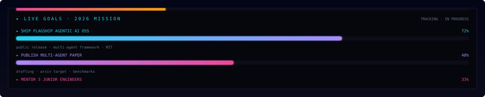
</div>

<br/>

| goal | status | progress |
|:---|:---:|:---:|
| Ship flagship Agentic AI OSS | `LIVE` | **72%** |
| Publish multi-agent paper | `LIVE` | **48%** |
| Mentor 3 junior engineers | `LIVE` | **33%** |
| Continue building in public | `LIVE` | **∞** |

---

<!-- ═══════════════════════════════════════════════════════════════════════ -->
<!-- ✦ SECTION 18 · LIFE HEATMAP                                          -->
<!-- ═══════════════════════════════════════════════════════════════════════ -->

##  19 · LIFE HEATMAP · 52 WEEKS

<div align="center">
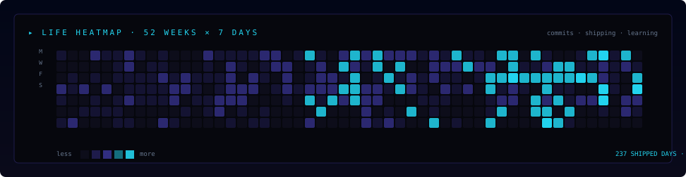
</div>

---

<!-- ═══════════════════════════════════════════════════════════════════════ -->
<!-- ✦ SECTION 19 · GITHUB ANALYTICS                                       -->
<!-- ═══════════════════════════════════════════════════════════════════════ -->

##  20 · DIGITAL DNA · SOURCE CODE GENOME

<div align="center">
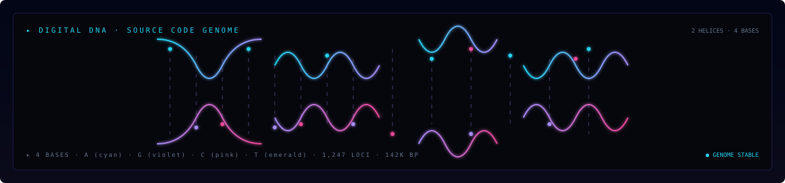
</div>

<br/>

The source code of a mind has a structure. It's not random — it's a genome.
Some patterns are inherited. Some are learned. All of it is evolving.

---

##  21 · AGENT MESH · LIVE COORDINATION

<div align="center">
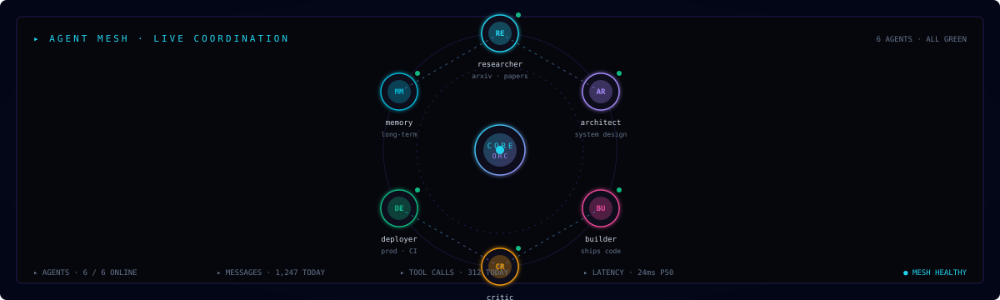
</div>

<br/>

Six agents. Six roles. One shared goal.
The mesh doesn't break when one agent fails. It reroutes.

---

##  22 · GITHUB ANALYTICS · LIVE TELEMETRY

<div align="center">

<p>
  
  &nbsp;
  
  &nbsp;
  
</p>

<br/>


&nbsp;


<br/><br/>


&nbsp;


</div>

<br/>

<div align="center">
  
</div>

<br/>

<div align="center">
  <sub>⚙️ Metrics auto-refresh hourly · snake refreshes daily · uptime measured continuously.</sub>
</div>

---

<!-- ═══════════════════════════════════════════════════════════════════════ -->
<!-- ✦ SECTION 20 · CONTRIBUTION SNAKE                                    -->
<!-- ═══════════════════════════════════════════════════════════════════════ -->

##  23 · CONTRIBUTION SNAKE · LIVE

<div align="center">
  <picture>
    <source media="(prefers-color-scheme: dark)" srcset="https://raw.githubusercontent.com/jv-singh/jv-singh/output/github-snake-dark.svg"/>
    <source media="(prefers-color-scheme: light)" srcset="https://raw.githubusercontent.com/jv-singh/jv-singh/output/github-snake.svg"/>
    
  </picture>
</div>

<p align="center">
  <sub>🐍 Animated by <a href="https://github.com/Platane/snk">Platane/snk</a> · refreshes every 12 hours</sub>
</p>

---

<!-- ═══════════════════════════════════════════════════════════════════════ -->
<!-- ✦ SECTION 21 · SUPPORT                                               -->
<!-- ═══════════════════════════════════════════════════════════════════════ -->

##  24 · SUPPORT · KEEP THE COFFEE FLOWING

<div align="center">

If my work helps you build something useful,
consider supporting open-source AI research.

<br/><br/>

<a href="https://github.com/sponsors/jv-singh">
  
</a>
&nbsp;
<a href="https://www.buymeacoffee.com/jvsingh">
  
</a>
&nbsp;
<a href="https://ko-fi.com/jvsingh">
  
</a>

</div>

---

<!-- ═══════════════════════════════════════════════════════════════════════ -->
<!-- ✦ SECTION 22 · CONNECT                                               -->
<!-- ═══════════════════════════════════════════════════════════════════════ -->

## 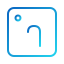 25 · CONNECT · OPEN THE CHANNEL

<div align="center">

<a href="https://www.linkedin.com/in/jv-singh">
  
</a>
&nbsp;
<a href="https://github.com/jv-singh">
  
</a>
&nbsp;
<a href="https://twitter.com/jv_singh">
  
</a>
&nbsp;
<a href="mailto:jaivardhan@example.com">
  
</a>
&nbsp;
<a href="https://discord.gg/your-discord">
  
</a>

</div>

---

<!-- ═══════════════════════════════════════════════════════════════════════ -->
<!-- ✦ SECTION 23 · EDUCATION                                              -->
<!-- ═══════════════════════════════════════════════════════════════════════ -->

##  26 · EDUCATION

<div align="center">

| Degree | Institution | Focus | Graduation |
|:---:|:---|:---|:---:|
| 🎓 **B.Tech — Data Science** | **Amity University** | ML · AI · Statistics · Engineering | **2027** |

</div>

---

<!-- ═══════════════════════════════════════════════════════════════════════ -->
<!-- ✦ SECTION 24 · ACHIEVEMENTS                                          -->
<!-- ═══════════════════════════════════════════════════════════════════════ -->

##  27 · ACHIEVEMENTS · BLUEPRINTS SHIPPED

<div align="center">

|  |  |  |  |
|:---:|:---:|:---:|:---:|
| 🎖️ **Open-Source Builder** | 🧠 **Agentic AI Specialist** | 🛠️ **Production ML** | 🚀 **Multi-Internship** |
| Active contributor | deep in RAG · agents | shipping at scale | 4 internships · 3 orgs |

</div>

---

<!-- ═══════════════════════════════════════════════════════════════════════ -->
<!-- ✦ SECTION 25 · CURRENTLY BUILDING                                    -->
<!-- ═══════════════════════════════════════════════════════════════════════ -->

##  28 · CURRENTLY · BUILDING / LEARNING / VIBING

<div align="center">

|  **BUILDING** |  **LEARNING** | 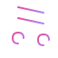 **VIBING** |
|:---:|:---:|:---|
| Agentic AI workflows | MCP / A2A protocols | Lo-fi while training models |
| RAG eval pipelines | LangGraph deep-dives | Synthwave while shipping |
| Open-source tools | Reinforcement learning | Instrumental while debugging |

</div>

---

<!-- ═══════════════════════════════════════════════════════════════════════ -->
<!-- ✦ SECTION 26 · WORDS I LIVE BY                                       -->
<!-- ═══════════════════════════════════════════════════════════════════════ -->

##  29 · WORDS I LIVE BY

<div align="center">

> *"The best way to predict the future is to invent it."*
> — **Alan Kay**

<br/>

> *"Any sufficiently advanced technology is indistinguishable from magic."*
> — **Arthur C. Clarke**

<br/>

> *"The computer was born to solve problems that did not exist before."*
> — **Bill Gates**

</div>

---

<!-- ═══════════════════════════════════════════════════════════════════════ -->
<!-- ✦ FOOTER                                                              -->
<!-- ═══════════════════════════════════════════════════════════════════════ -->

<div align="center">

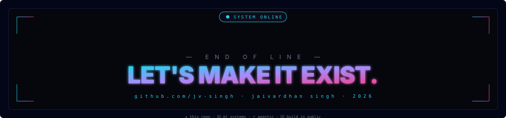

<br/><br/>

```ascii
   ╔══════════════════════════════════════════════════════════╗
   ║                                                          ║
   ║   THE BEST WAY TO PREDICT THE FUTURE IS TO INVENT IT.    ║
   ║                                                          ║
   ║   ··················································    ║
   ║                                                          ║
   ║   github.com/jv-singh                                    ║
   ║   jaivardhan singh                                       ║
   ║   ──────────────────────────────────────────────────     ║
   ║   let's make it exist.                                   ║
   ║                                                          ║
   ╚══════════════════════════════════════════════════════════╝
```

<br/>


<br/><br/>

<sub>© 2026 · Designed & built with ❤️ by <b>Jaivardhan Singh</b> · <i>Let's Make It Exist.</i></sub>

<br/>

⭐ **If this profile inspired you — drop a star on the repo.**

</div>

---

<!-- ═══════════════════════════════════════════════════════════════════════ -->
<!-- ✦ EPILOG · Built with custom assets                                   -->
<!-- ═══════════════════════════════════════════════════════════════════════ -->

<div align="center">

<sub>
This README was built with 54+ custom SVG assets, animated states, and a single design philosophy:
<b>every section MUST tell a story the visitor has never seen before.</b><br/>

<kbd>📁 assets/svg/</kbd> · <kbd>icons · projects · meters · diagrams · sections</kbd><br/>
<kbd>📁 .github/workflows/</kbd> · <kbd>metrics · snake · auto-update · lint-assets</kbd><br/>
<kbd>📁 scripts/</kbd> · <kbd>regenerate SVGs · live status · future tools</kbd><br/>
<kbd>📁 docs/</kbd> · <kbd>architecture · deployment · future ideas</kbd>
</sub>

</div>
